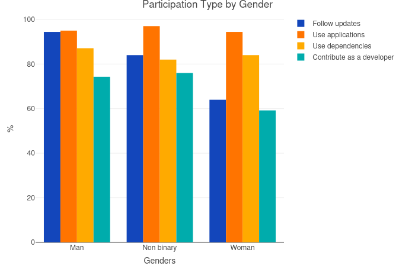
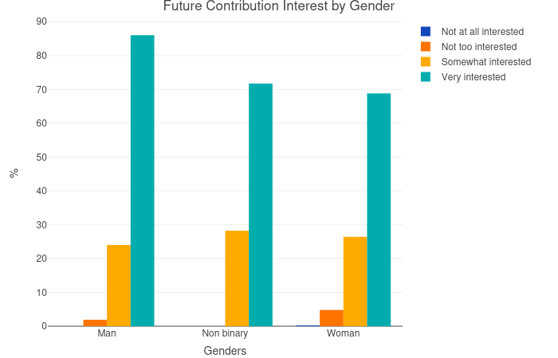
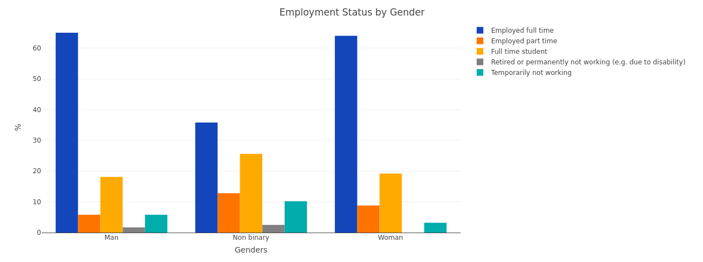
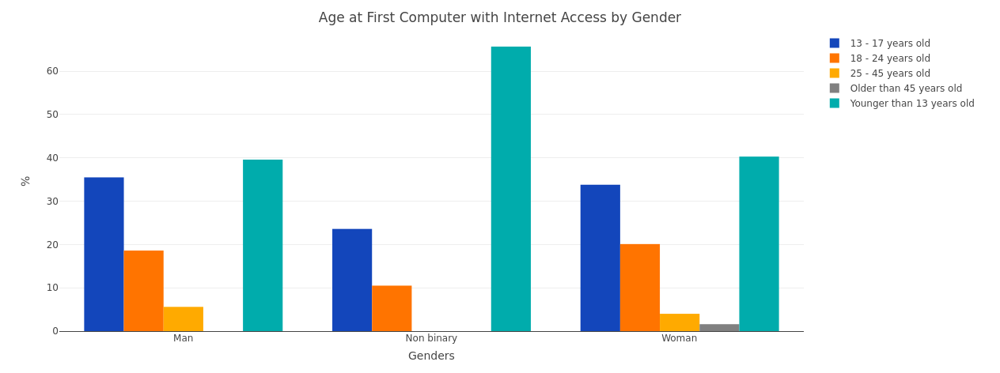

# Women, non-binary and men in OSS communities

As a contributor to the Diversity team of Mozilla I made an analysis about how OSS users are engaged with their community. I've dedicated special attention to women and their relation to the community. The data was extracted from Github's Open Source survey from 2017.

## Absolute Numbers

Women participate in OSS communities at a much lower rate than men. Seeing this extremely discrepant data motivated me to run this small research.

From 3551 people that declared their gender identity in the questionnaire, 3387 were men (95.4%), 125 were women (3.52%) and 39 were non-binary (1.08%). I did not find good sources on what's the percentage of people who identify as non-binary in the world, because most demographic censuses don't even consider the existance of non-binary people. But the percentages of women and men in the world are [about the same](https://data.worldbank.org/indicator/SP.POP.TOTL.FE.ZS).

Which brings the question: why are there so few women in OSS?

## Participation Type

First, I looked at the different types of participation reported on the survey. Check the alternatives: 

* Follow updates and discussions of open source projects;
* Use open source applications; 
* Use open source software as dependencies in other projects; 
* Participate in open source software development (including making feature requests, filing bugs, contribution of documentation or code, project maintenance, etc.). The participants could make multiple selections. This is what I found:

It's interesting to notice that almost the same amount of women, men and non-binary use dependencies and OSS applications. But 74.3% of people who identified as men and 76% of people who identified as non binary contributed as a developer for OSS while only 59.2% of people who identified as women contributed as developers. Women also tend to follow updates from OSS much less (64%) than men do (94.4%).

Many women come to Github to use the open source applications that are availabe here, but a considerable number of women don't follow the updates of the community nor contribute as a developer, in other words they're not interacting directly with the community.

## Future Contribution Interest

I analysed what was the contribution interest of the participants by measuring how much they were interested in making a contribution to OSS: 

* Very interested; 
* Somewhat interested; 
* Not too interested; 
* Not at all interested. 

Here are the results:

Even though women did not participate in OSS communities as much as men and non-binary people did they are very interested and intend to contribute to OSS. Their interest in contributing is close to people identified as non-binary around 70% and still lower than the insterest shown by men 87%.

## Formal Education

Data about formal education of the people who answered the questionnaire was also collected. People answered what was their highest level of formal education: 

* Less than secondary (high) school; 
* Secondary (high) school graduate or equivalent; 
* Some college and no degree
* Vocational/trade program or apprenticeship 
* Bachelor's degree, master's degree or doctorate (Ph.D.) other advanced degree (e.g. M.D., J.D.).

I wondered if formal education was a characteristic that would interfere with the contribution and presence of women in the OSS communities. From these data I learned that even though women tend to have a lower degree of formal education than men, the numbers are not so discrepant as I expected. But because of the need that women have to [prove themselves frequently](http://www.pewsocialtrends.org/2018/01/09/women-and-men-in-stem-often-at-odds-over-workplace-equity/ps_2018-01-09_stem_2-07/) in sexist environments and because of [impostor syndrome](https://en.wikipedia.org/wiki/Impostor_syndrome) it might be a relevant reason why women engage less with OSS than men. Meanwhile the non binary presented the lowest level of formal education, but it doesn't seem to interfeer with how much they participate in OSS communities, since their rates of engagement are similar to those of men.

## Employment Status

Another type of data that the Github's survey offered was the emplyoment status of the respondent. The participants could choose between: 

* Employed full time; 
* Employed part time; 
* Full time student; 
* Temporarily not working or retired/permanently not working (e.g. due to disability);
* Not working at the moment.

I imagined that women couldn't spend much time contributing to OSS because they're, generally, more occupied than men working or maybe studying, but the graphs for both gender identities are very similar. Therefore, I don't think that the time spent with work or school is a problem. Of course this could also be explained by women [double burden](https://en.wikipedia.org/wiki/Double_burden)[1](http://conconi.ulb.be/db.pdf), but this data set doesn't provide enough data to corroborate this hypothesis.

## Age at First Computer with Internet Access

I also asked myself if there was any relation between the age at which someone started to use a computer and how much they'd be engaged in OSS communities, the participants could choose between the following options: 

* Younger than 13 years old;
* 13 - 17 years old; 
* 18 - 24 years old; 
* 25 - 45 years old;
* Older than 45 years old.

As the graph shows there is, there is apparently no relation between the time that participants had with computers with internet access and their gender indentity, since all of the graphs are very similar. Except for people who identified as non-binary, who were much more likely to be younger than 13 years old. In any case, I don't believe this is a relevant characterisct to explain less participation of women in the community since their data is very similar to men and somewhat similar to non-binary.

## Age by gender

At last, the last avalyses that I thought was relevant for the purpose of my research was if age is one of the reasons for this discrepancy. The age ranges varied between: 

* 17 or younger; 
* 18 to 24 years; 
* 25 to 34 years; 
* 35 to 44 years; 
* 45 to 54 years; 
* 55 to 64 years; 
* 65 to 74 years; 
* 75 years or older.

The data shows that women, non-binary and men have similar age distributions. Therefore, I believe this is another aspect that isn't relevant to explain the lower engagement of women in the OSS communitties.

## Conclusion

Women are tipically [underrepresented](http://www.unesco.org/new/en/media-services/single-view/news/women_still_a_minority_in_engineering_and_computer_science/) in the STEM fields because of an intrisic sexism that trace to hundreds of years in human society and I believe this is the main reason why there are consideraly less women in computing nowadays. In the beggining computer science strongly depended and counted with the brighteness of women like Ada, Hopper and many other women who programmed and made calculations for the first computers, but for the last decades the field was dominated and controlled by men who secluded women.

Happily, women are taking their place back again in this wonderful field, there are many initiatives trying to dissolve the history of disincentive that women have.

What I could understand from the study of the datum is that women, people who identify as non-binary and men are basically the same when the subject is interest in participating OSS communities. As shown in the graph "Future Contribution Interest by Gender", even though women don't contribute as much as men to the community they still want to do it, maybe what is lacking is more incentive and a more open and welcoming environment for begginers and for women.

Codes of conduct that guarantee a safe place to women and a more respectful and empathetic community, besides what have been said, may be the solution to increase the number of women in OSS communities.

## Development

I used RStudio to visualize the datum I needed from the tables and also to create new tables and csv files. I found out it was a good software for data visualization.

To write the code that generate the graphs I've used [plotyly](https://plot.ly/) a very complete tool that uses R and the ggplot (and also Python and Javascript, but following the issue's specifications I've used R). 
As someone who just started programming R I found plotyly approachble and easy to use.

Everything that I code can be found in this repository at code/.

I've also used [paletton](http://paletton.com) to choose nice matching colors to the graphs since how people perceive data is also important.
